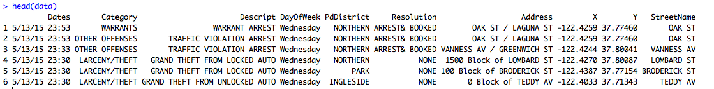
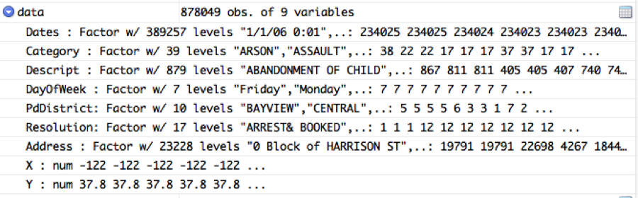

# San Francisco Crime Classification (Kaggle Competition)

**Note: This is a Work in Progress** 

## Summary and Objectives

On June 2, 2015 a Kaggle competition titled "San Francisco Crime Classification" was launched with the following objective statement:

> From 1934 to 1963, San Francisco was infamous for housing some of the world's most notorious criminals on the inescapable island of Alcatraz.

> Today, the city is known more for its tech scene than its criminal past. But, with rising wealth inequality, housing shortages, and a proliferation of expensive digital toys riding BART to work, there is no scarcity of crime in the city by the bay.

> From Sunset to SOMA, and Marina to Excelsior, this competition's dataset provides nearly 12 years of crime reports from across all of San Francisco's neighborhoods. Given time and location, you must predict the category of crime that occurred.

This competition was interesting to me not just because of my proximity to San Francisco, or because I have had close friends victimized in the city, but also because it was an opportunity to use data science for the public good. 

Can we do analysis on this data that reveals trends in crime that were previously unknown? 

## Data Acquisition

The data is provided on the [Kaggle competition website](https://www.kaggle.com/c/sf-crime/data). 

You will need to download at least the test.csv and train.csv files. These files are compressed in zip archives. To use the same paths I will in this report, extract the files to your "~/Kaggle/San Francisco Crime Classification" directory.

## Data Ingestion
Lets load the training data Kaggle provided by using the built-in Comma Separated Values (CSV) reader function:

```R
data = read.csv('Kaggle/San Francisco Crime Classification/train.csv')
```

This read.csv function automatically handles special cases found in this dataset such as a comma as part of a variable's contents not intended as a value separator.

We can get a first-look at the values in the dataset by using the R head function,```R head(data) ```:



## Data Preparation

### Factor vs Ordinal

R Brought in the days of the week as a Factor. 


The fact is that whether you think the week starts on Sunday or Monday, the set of days do have an implied order (and its not alphabetical as R sets it). To properly handle this variable with any algorithm that can make use of the order, lets convert this column to ordinal with Sunday as the first day of the week. 

```R
data$DayOfWeek = ordered(data$DayOfWeek, levels=c('Sunday','Monday','Tuesday','Wednesday','Thursday','Friday','Saturday'))
```
